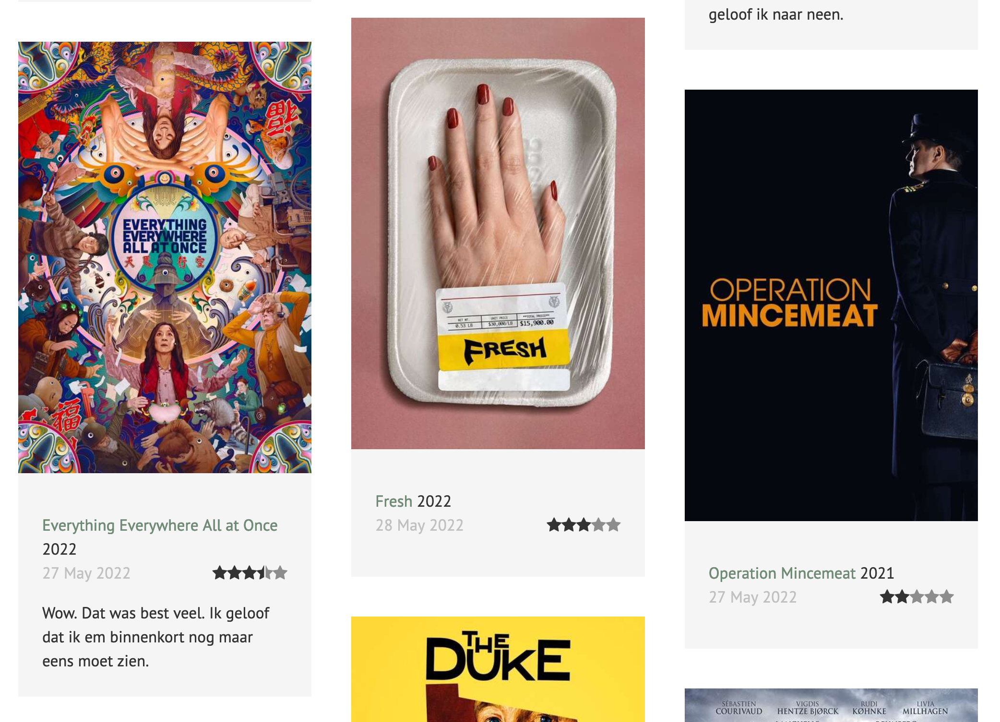

# Kirby Plugin: MyLetterboxd

This plugin allows you to show recent posts for a Letterboxd account on your Kirby site

## Git submodule

```
git submodule add https://github.com/mirthe/kirby_myletterboxd site/plugins/myletterboxd
```

## Usage

Add your username to your config

    'letterboxd.username'    => 'xxx',

Include the snippet to display your movies on a page

    <?php snippet('letterboxd-movies-watched'); ?>

## Example 



## Todo

- Offer as an official Kirby plugin
- Add translations for labels
- Add sample SCSS to this readme
- Cleanup code
- Lots..
